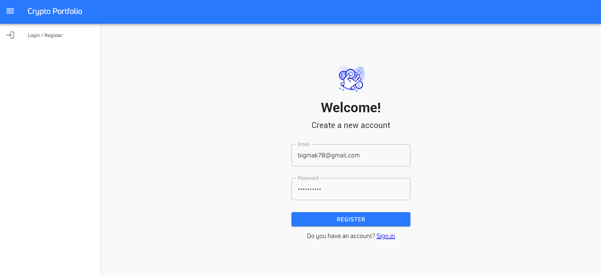
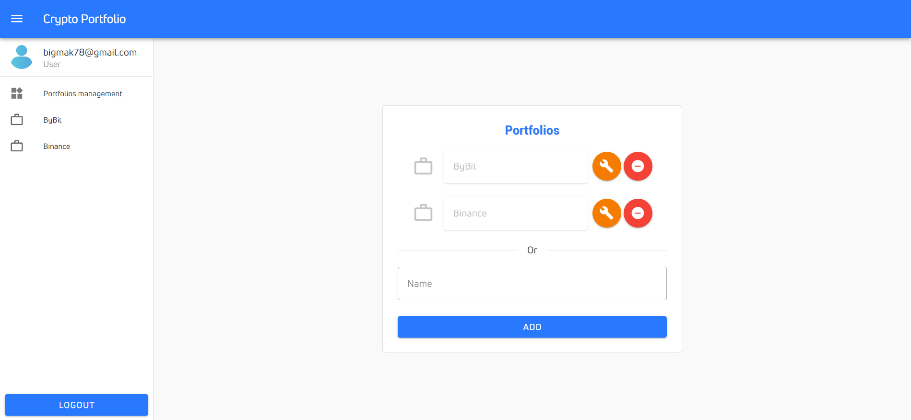
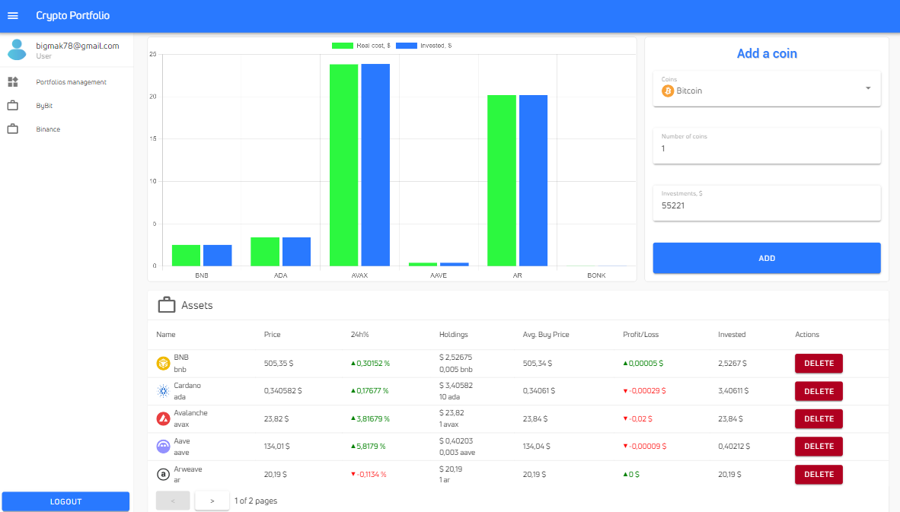

# crypto-portfolio

Online crypto portfolio, a place to track all of a user's cryptocurrency investments.

## Project Setup

```sh
npm install
```

### Compile and Hot-Reload for Development

```sh
npm run dev
```

### Compile and Minify for Production

```sh
npm run build
```

## User registration



## Portfolio management



## User's portfolio


